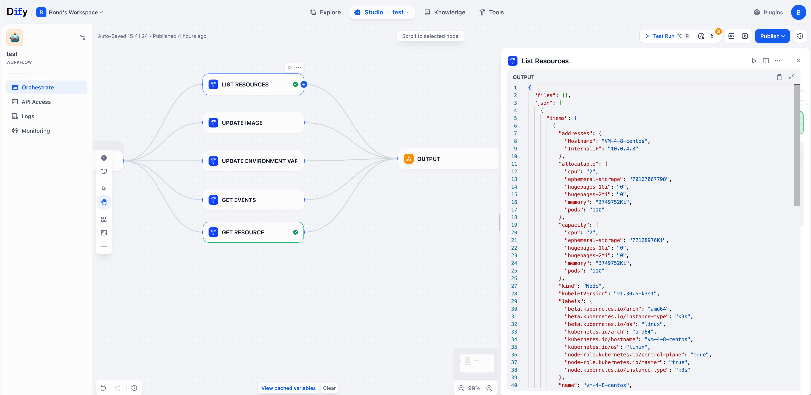

## K8s Updater

English | [中文说明](README.zh-Hans.md)

**Author:** bond-zhu  
**Version:** 0.0.1  
**Type:** tool

### Overview

- Operate Kubernetes clusters via a Dify plugin: list resources, get details, update images, update environment variables, and view events
- Uses the Kubernetes Python SDK; credentials come from your uploaded `kubeconfig`

### Workflow

### Result

### Credentials and TLS Mode

- Required: `kubeconfig` (base64 content or file path)
- Optional: `tlsMode`
  - `strict`: verify CA and hostname (default)
  - `skip-hostname`: skip hostname verification, still verify CA; useful when connecting via IP but the certificate lacks IP SAN
  - `insecure`: skip all verifications (for debugging only)
- Kubeconfig supports `clusters[].cluster.insecure-skip-tls-verify: true`
- Environment fallback: `K8S_TLS_MODE=skip-hostname` or `insecure`

### Tools and Logic

- List Resources
  - Purpose: list `nodes/pods/deployments/statefulsets/daemonsets/services/ingresses`
  - Params: `resourceType` (required, supports short names: `no/pod/deploy/sts/ds/svc/ing`), `namespace` (optional)
  - Behavior: probes connectivity via `list_namespace(limit=1)` and returns concise attributes per item
  - Output: `items` plus time info

- Get Resource
  - Purpose: get resource details in JSON or YAML
  - Params: `resourceType`, `name` (optional), `namespace` (defaults to `default` for namespaced kinds; ignored for `node`), `outputFormat` (`json` or `yaml`, default `json`)
  - Behavior: when `name` is empty, list resources; namespaced kinds list within `namespace` (default `default`); cluster-scoped kinds (e.g. `node`) list all
  - Output: `object` or `items`, plus time info

- Update Image
  - Purpose: update container images of `Deployment/StatefulSet/DaemonSet`
  - Params: `resourceType`, `name`, `namespace` (default `default`), `image`, `tag`, `container` (optional filter)
  - Behavior: computes desired image, builds minimal patch for `spec.template.spec.containers`, and applies `patch_namespaced_*`
  - Output: `changed` and `unchanged`, plus time info

- Update Environment Variables
  - Purpose: update container env vars of `Deployment/StatefulSet/DaemonSet`
  - Params: `resourceType`, `name`, `namespace` (default `default`), `envKey`, `envValue`, `container` (optional)
  - Behavior: builds minimal patch for container env lists and applies `patch_namespaced_*`
  - Output: `changed` and `unchanged`, plus time info

- Get Events
  - Purpose: fetch cluster events
  - Params: `namespace` (optional), `limit` (optional)
  - Behavior: uses `EventsV1Api`, falls back to `CoreV1Api` when needed
  - Output: `events` plus time info

### Examples

- List all pods: tool `List Resources`, leave `namespace` empty, set `resourceType=pod`
- Get a deployment: tool `Get Resource`, `resourceType=deployment`, `name=<NAME>`, `namespace=<NS>`, `outputFormat=json`
- Update image: tool `Update Image`, `resourceType=deployment`, `name=<NAME>`, `image=repo/app`, `tag=v1.2.3`
- Update env var: tool `Update Environment Variables`, `resourceType=deployment`, `name=<NAME>`, `envKey=LOG_LEVEL`, `envValue=debug`
- View events: tool `Get Events`, optionally set `namespace` and `limit`

### Connectivity and Common Issues

- On connect, the plugin probes `CoreV1Api.list_namespace(limit=1)`; failures are typically certificate or network issues
- If you see `certificate verify failed: IP address mismatch`:
  - Prefer changing kubeconfig `server` to a hostname that matches the certificate, or add IP SAN to the certificate
  - Or set `tlsMode=skip-hostname` to keep CA verification while skipping hostname match
  - For temporary debugging, `tlsMode=insecure` (not recommended for production)

