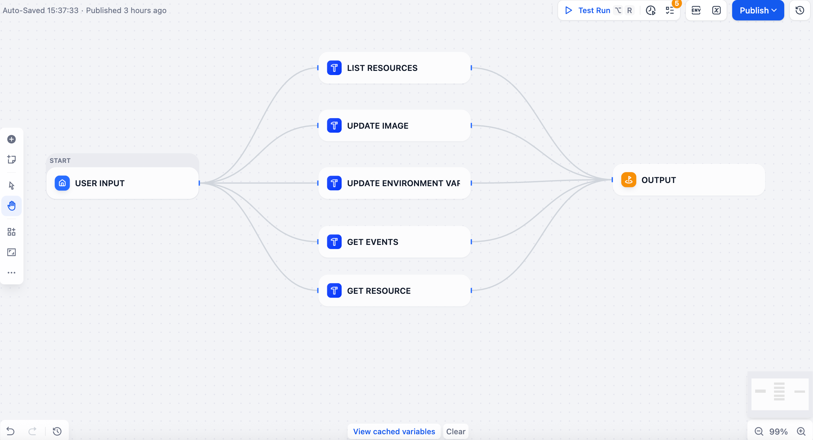

## K8s Updater

中文 | [English](README.md)

**Author:** bond-zhu  
**Version:** 0.0.1  
**Type:** tool

### 简介

- 通过 Dify 插件操作 Kubernetes 集群，支持读取资源、更新镜像、更新环境变量、查看事件与资源列表
- 插件使用 Kubernetes Python SDK 进行连接和操作，凭证来源于用户上传的 `kubeconfig`

### 工作流

### 凭证与 TLS 模式

- 必填凭证：`kubeconfig`（支持 base64 内容或文件路径）
- 可选凭证：`tlsMode`
  - `strict`：严格校验 CA 与主机名（默认）
  - `skip-hostname`：仅跳过主机名校验，仍验证 CA，适用于以 IP 直连但证书不含 IP SAN 的场景
  - `insecure`：不安全模式，跳过所有证书与主机名校验，仅用于临时排障
- 也可在 kubeconfig 中设置 `clusters[].cluster.insecure-skip-tls-verify: true` 达到跳过校验效果
- 无 UI 场景可用环境变量：设置 `K8S_TLS_MODE=skip-hostname` 或 `insecure`

### 工具列表与逻辑

– 获取资源列表（List Resources）
  - 功能：列出 `nodes/pods/deployments/statefulsets/daemonsets/services/ingresses`
  - 参数：`resourceType`（必填，支持短名：`no/pod/deploy/sts/ds/svc/ing`），`namespace`（可选）
  - 行为：构造 `ApiClient` 后进行一次连通性探测 `list_namespace(limit=1)`；随后按资源类型列出对象并返回精简属性
  - 输出：`items` 列表与时间信息

- 获取资源（Get Resource）
  - 功能：读取资源详情（JSON 或 YAML）
  - 参数：`resourceType`、`name`（可空）、`namespace`（命名空间类资源默认 `default`，对 `node` 忽略）、`outputFormat`（`json`/`yaml`，默认 `json`）
  - 行为：`name` 为空时进入列表模式；命名空间类资源按 `namespace`（默认 `default`）列出；非命名空间资源（如 `node`）列出所有
  - 输出：`object` 或 `items` 与时间信息

- 更新镜像（Update Image）
  - 功能：更新 Deployment/StatefulSet/DaemonSet 中容器镜像
  - 参数：`resourceType`、`name`、`namespace`（默认 `default`）、`image`、`tag`、`container`（可选过滤）
  - 行为：计算期望镜像，生成 `spec.template.spec.containers` 的最小 `patch` 并调用 `patch_namespaced_*`
  - 输出：`changed`/`unchanged` 容器列表与时间信息

- 更新环境变量（Update Environment Variables）
  - 功能：更新 Deployment/StatefulSet/DaemonSet 中容器环境变量
  - 参数：`resourceType`、`name`、`namespace`（默认 `default`）、`envKey`、`envValue`、`container`（可选过滤）
  - 行为：按容器生成环境变量变更的最小 `patch` 并调用 `patch_namespaced_*`
  - 输出：`changed`/`unchanged` 容器列表与时间信息

- 获取事件（Get Events）
  - 功能：查询集群事件
  - 参数：`namespace`（可选）、`limit`（可选，返回条数上限）
  - 行为：优先使用 `EventsV1Api`，失败回退 `CoreV1Api`；返回事件的关键信息
  - 输出：`events` 列表与时间信息

### 使用示例

- 列出所有命名空间的 Pod：选择“获取资源列表”，不填 `namespace`，`resourceType=pod`
- 读取某个 Deployment：选择“获取资源”，`resourceType=deployment`，`name=<NAME>`，`namespace=<NS>`，`outputFormat=json`
- 更新镜像：选择“更新镜像”，`resourceType=deployment`，`name=<NAME>`，`image=repo/app`，`tag=v1.2.3`
- 更新环境变量：选择“更新环境变量”，`resourceType=deployment`，`name=<NAME>`，`envKey=LOG_LEVEL`，`envValue=debug`
- 查看事件：选择“获取事件”，可选 `namespace` 与 `limit`

### 连通性与常见问题

- 连接后会进行探测：`CoreV1Api.list_namespace(limit=1)`；若报错通常为证书或网络问题
- 如果出现 `certificate verify failed: IP address mismatch`：
  - 建议将 kubeconfig 的 `server` 改成证书匹配的域名，或为证书添加 IP SAN
  - 或在凭证选择 `tlsMode=skip-hostname`，保留 CA 校验但跳过主机名匹配
  - 临时排障可选 `tlsMode=insecure`（不安全）